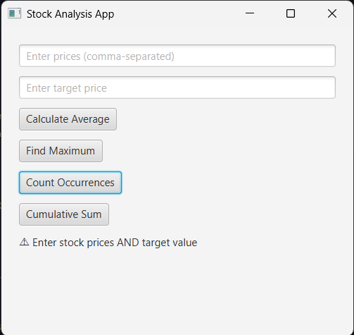
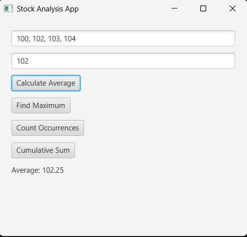
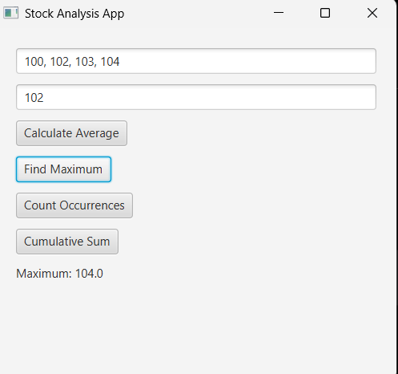
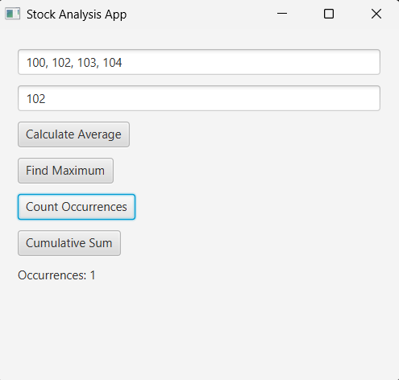
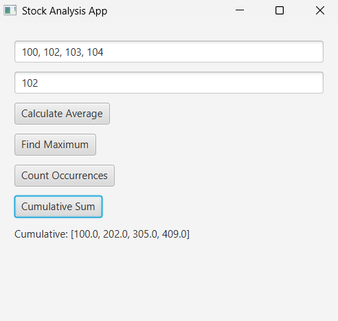

```markdown


# 📊 Stock Analysis JavaFX App

A desktop-based stock analysis tool built using JavaFX and Maven.  
The application performs basic financial data analysis using arrays and ArrayLists in Java.

---

## 🚀 Features

- 📈 Calculate average stock price  
- 🔝 Find maximum stock price  
- 🔁 Count occurrences of a specific price  
- 📊 Compute cumulative sum of stock prices  
- 🖥️ Interactive JavaFX user interface  
- ⚡ Input validation and error handling  

---

## 🛠️ Tech Stack

- Java 17+
- JavaFX
- Maven
- OOP Principles
- Data Structures (Arrays & ArrayLists)

---

## 📂 Project Structure

src/
└── main/
└── java/
└── com/femzyk/
└── StockApp.java
pom.xml


---

## ▶️ How to Run

### Using Maven:
```bash
mvn clean javafx:run


## 📸 Screenshots

### Main Dashboard


### Average Calculation


### Maximum Value


### Occurrence Result


### Cumulative Sum


🧠 Key Concepts Demonstrated
Array manipulation in Java

ArrayList operations

Event-driven programming (JavaFX)

Exception handling

Modular programming design

📊 Example Input
100.5, 102.0, 101.5, 103.0, 104.2
Target: 102.0

## 💡 What I Learned

This project strengthened my understanding of:
- Data structures in Java
- UI development using JavaFX
- Clean code organization using Maven
- Handling user input validation in real applications


👨‍💻 Author
FEMZYK ENTERPRISES LTD
run by
OLUFEMI BENUA KERIPE
GitHub: https://github.com/FEMZYKENTLTD

📌 License
This project is for educational and portfolio demonstration purposes.

